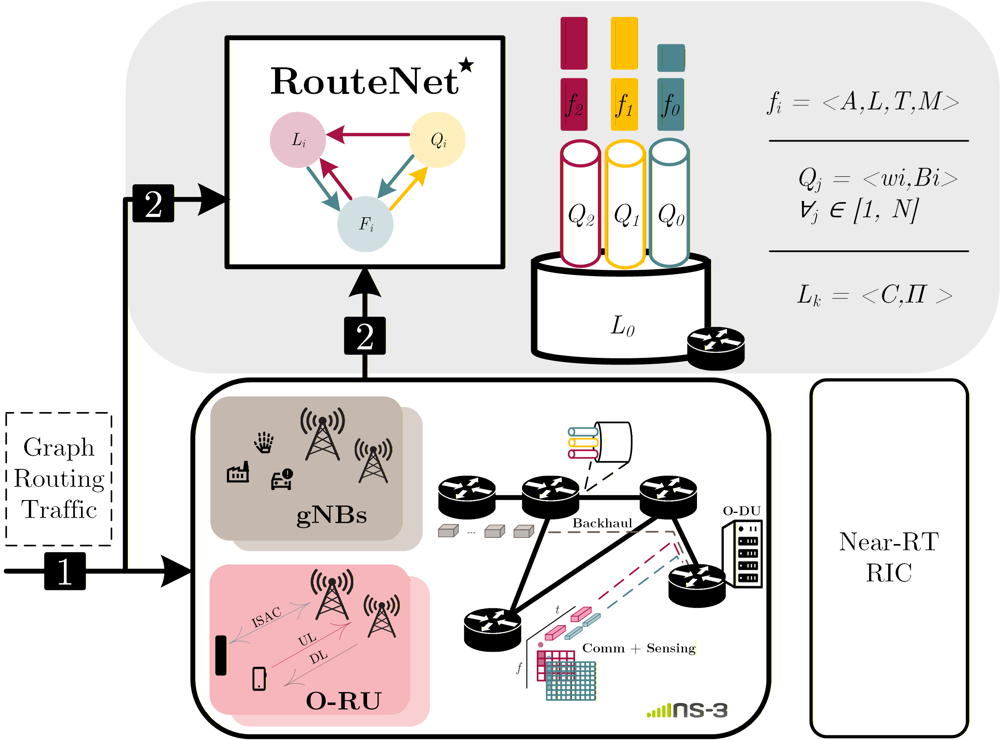

# GNN-based e2e performance prediction in RAN 

This repository contains an implementation of a Graph Neural Network (GNN)-based approach for end-to-end (E2E) performance prediction in Radio Access Networks (RAN), with a particular focus on x-haul scenarios.

The proposed architecture models the network as a graph, where nodes and links represent network elements and their relationships. The GNN is trained using datasets generated from ns-3 simulations to learn the underlying network relationships and capture their impact on E2E performance.

**Architecture**

The overall system architecture is illustrated in the figure below:

<div align="center">
  
</div>

It includes the following main components:

- Dataset generation by means of network simulations 
- Parser from simulation traces to $\text{RouteNet}^{\star}$ architecture
- GNN model for performance prediction
- Evaluation and analysis tools


**Repository structure**

- `RouteNet-Fermi/` – GNN architecture 
- `generate-datasetsHQoS_multiproc/` – Dataset generation  
- `simulation-analysis.ipynb` – Results analysis notebook  
- `requirements.txt` – Python dependencies  


## Reproducilability 
To ensure full reproducibility of the results presented in this work, the repository provides an end-to-end pipeline covering dataset generation, preprocessing, model training, and evaluation.

### 1. Requirements
The proposed framework has been validated using Python 3.7. In order to install dependencies:

```bash
pip install -r requirements.txt
```

### 2. Dataset Generation
Network datasets are generated using ns-3 simulation scenarios. The scripts responsible for automating the dataset generation process are located in the `generate-datasetsHQoS_multiproc/` directory.
The main simulation script can be executed as follows:
```bash
python datasets_gen_scs_bw_01.py --ns3-path ../ns-allinone-3.39/ns-3.39 --sim-time 1 --max-workers 3
```
This script launches parallel ns-3 simulations and produces raw TX/RX traces, which constitute the initial dataset for subsequent processing and model training.

### 3. Parsing dataset
Raw simulation outputs are converted into graph-based inputs compatible with the  $\text{RouteNet}^{\star}$ architecture.
- First, in order to split the dataset into three sets (trainining/validation/test) use the following script [`movedatasetszip.py`](generate-datasetsHQoS_multiproc/movedatasetszip.py)
The script includes configurable parameters that allow customizing the dataset splitting process. In particular, the base dataset path, output directories, and split ratios can be modified according to the user’s requirements.
- Second, adapt it to the $\text{RouteNet}^{\star}$ architecture' inputs, for that porpuse use the script [`get_datatsets_routenet_format_from_zip_nproc.py`](generate-datasetsHQoS_multiproc/get_datatsets_routenet_format_from_zip_nproc.py). This script is configurable through command-line arguments, allowing adaptation to different dataset locations.

### 4. Model Training 
To train the model, it is necessary to execute the data generation script located in the `/RouteNet-Fermi/HQoS/` directory, specifically [`data_generatorHQoS.py`](./RouteNet-Fermi/HQoS/train_with_MAPE.py).
The training script includes several configurable hyperparameters and paths that can be adjusted according to the current setup.

### 5. Evaluation Setup 
To evaluate the performance of the GNN model, a Jupyter notebook is provided at [`performance.ipynb`](./RouteNet-Fermi/HQoS/performance.ipynb). 
This notebook contains the code used for the evaluation and analysis of the results presented in the paper, including the main performance metrics and visualization of the model outputs.

### 6. Artifacts

- [`final_set_dataset`](./RouteNet-Fermi/final_set_dataset/) includes the processed dataset used for training the proposed GNN model.

- [`ckpts_final_1_bacth_logs_EarlyStopping8`](./RouteNet-Fermi/HQoS/ckpts_final_1_bacth_logs_EarlyStopping8/) contains the trained model checkpoints used for inference and performance evaluation.


## Setup Features

### A. Computing Environment

Experiments were conducted in a virtual machine:

- **OS:** Ubuntu 22.04.3 LTS  
- **Kernel:** 5.15.0-88-generic  
- **Virtualization:** VMware (full virtualization)

### B. Hardware Configuration

The system consists of an Intel Xeon-based virtual machine with 8 virtual CPUs:

- **CPU:** Intel(R) Xeon(R) Silver 4214R @ 2.40GHz  
- **Architecture:** x86_64  
- **Cores:** 8 vCPUs  
$\rightarrow$ All experiments were executed on CPU-only infrastructure, without GPU acceleration.

---


# Notes
Large simulation environments (e.g., ns-3) and virtual environments are excluded via .gitignore.
Make sure to install dependencies in your own environment.


> **Work in progress**. This README is under construction.
>  For questions or issues, feel free to reach out: [fatima.khan@unican.es](mailto:fatima.khan@unican.es)