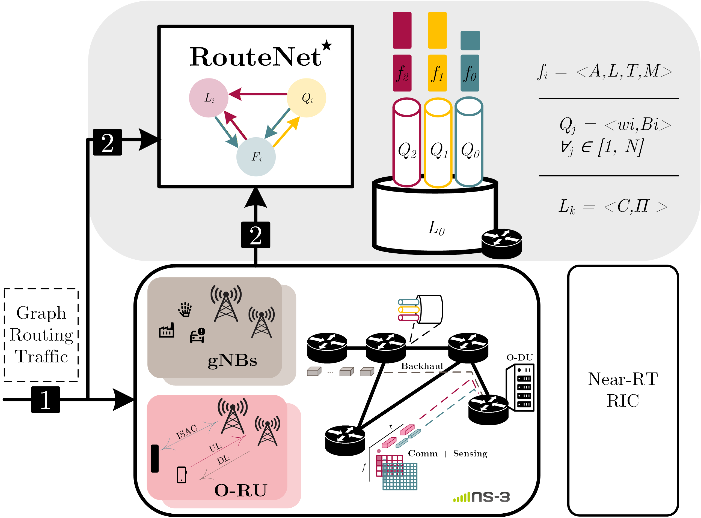

# GNN-based e2e performance prediction in RAN 

This repository contains an implementation of a Graph Neural Network (GNN)-based approach for end-to-end (E2E) performance prediction in Radio Access Networks (RAN), with a particular focus on x-haul scenarios.

The proposed architecture models the network as a graph, where nodes and links represent network elements and their relationships. The GNN is trained to learn complex dependencies and predict E2E delay.

**Architecture**

The overall system architecture is illustrated in the figure below:

  

It includes the following main components:

- Dataset generation by means of network simulations 
- Parser from simulation traces to $\text{RouteNet}^{\star}$ architecture
- GNN model for performance prediction
- Evaluation and analysis tools

**Repository structure**

- `RouteNet-Fermi/` – Core GNN model implementation  
- `generate-datasetsHQoS/` – Dataset generation scripts  
- `generate-datasetsHQoS_multiproc/` – Parallel dataset generation  
- `simulation-analysis.ipynb` – Results analysis notebook  
- `requirements.txt` – Python dependencies  

**Notes**

Large simulation environments (e.g., ns-3) and virtual environments are excluded via .gitignore.
Make sure to install dependencies in your own environment.

> **Work in progress**. This README is under construction.
> For questions or issues, feel free to reach out: [fatima.khan@unican.es](mailto:fatima.khan@unican.es)